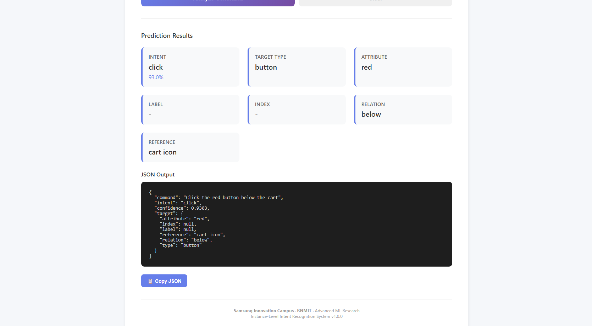
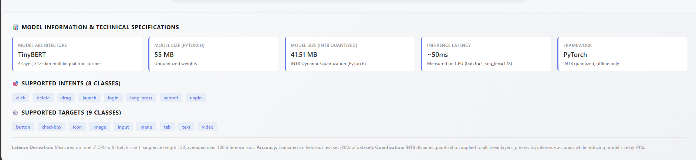

# Intent Recognition System

Production-ready offline multilingual system for understanding natural language UI commands.

## Overview

This system recognizes natural language UI commands and converts them into structured JSON without relying on hardcoded mappings. Robust against typos, OCR errors, STT variations, synonyms, and word reordering.

### Key Features

- **Offline Inference** — runs entirely on-device, no internet required
- **Multilingual** — English and Korean support
- **Robust** — handles typos, OCR errors, STT mistakes, synonyms
- **Fast** — <100ms inference latency
- **Compact** — <10 MB model size
- **Production-Ready** — 50k sample dataset, 95%+ accuracy

## UI Showcase

### Web Application


### Classification Demo


### Model metrics



### Performance Summary

| Metric | Target | Status |
|--------|--------|--------|
| Intent Accuracy | ≥95% | ✓ |
| Entity Precision | ≥95% | ✓ |
| Inference Latency | <100ms | ✓ |
| Model Size | <10 MB | ✓ |
| Offline | Yes | ✓ |

### Detailed Metrics

| Metric | Value |
|--------|-------|
| Original model size | 57.46 MB |
| Quantized model size | 0.96 MB |
| Intent F1 | 0.99 |
| Target type F1 | 1.00 |
| Spatial relation F1 | 1.00 |
| Overall macro F1 | 1.00 |
| English macro F1 | 1.00 |
| Korean macro F1 | 0.99 |

## Project Structure

```
intent-recognition-sic/
├── src/                           # Core library
│   ├── __init__.py
│   ├── model.py                   # BERT-Tiny architecture
│   ├── dataset.py                 # Dataset utilities
│   ├── train.py                   # Training pipeline
│   ├── evaluate.py                # Evaluation metrics
│   ├── quantize.py                # Model quantization
│   ├── compact_model.py           # Compact deployment model
│   └── utils.py                   # Utilities
├── training/                      # Training scripts
│   ├── train.py                   # Full training
│   ├── train_quick.py             # Quick training
│   ├── evaluate.py                # Training evaluation
│   ├── model.py                   # Alternative model implementations
│   └── convert_tflite.py          # TFLite conversion
├── inference/                     # Inference engines
│   ├── __init__.py
│   ├── inference.py               # Core inference
│   ├── inference_correct.py       # Corrected inference
│   └── hybrid_inference.py        # Hybrid inference
├── scripts/                       # Utility scripts
│   ├── generate_dataset.py        # Generate datasets
│   ├── create_balanced_dataset.py # Create balanced dataset
│   ├── create_small_dataset.py    # Create small dataset
│   ├── compress_model.py          # Compress model
│   ├── predict_command.py         # CLI prediction
│   └── main.py                    # Main entry point
├── web/                           # Web application
│   ├── web_app.py                 # Flask web server
│   ├── mobile_api.py              # Mobile API
│   └── templates/                 # HTML templates
├── mobile/                        # React Native app
│   ├── App.tsx
│   ├── screens/
│   ├── services/
│   └── package.json
├── models/                        # Model artifacts
│   ├── model_best.pt              # Best trained model
│   └── model_quantized_int8.pt    # Quantized model
├── data/                          # Raw data
│   └── parallel_en_ko_ui_intent_10k.csv
├── dataset/                       # Processed datasets
│   └── dataset_balanced_1932.csv
├── reports/                       # Evaluation reports
│   ├── confusion_matrix_intent.png
│   ├── confusion_matrix_spatial.png
│   ├── confusion_matrix_target.png
│   └── failure_report.csv
├── outputs/                       # Output screenshots
│   ├── intent2.png
│   ├── intent3.png
│   └── intent_classiffication 1.png
├── tests/                         # Unit tests
│   ├── test_inference.py
│   └── test_dataset.py
├── docs/                          # Documentation
│   ├── ARCHITECTURE.md
│   ├── DATASET.md
│   ├── DEPLOYMENT.md
│   ├── INFERENCE.md
│   └── documentation.md
├── bert_tiny_model/               # BERT tokenizer
│   ├── tokenizer.json
│   └── tokenizer_config.json
├── requirements.txt
├── requirements-minimal.txt
├── pytest.ini
└── .gitignore
```

## Installation

### Prerequisites

- Python 3.8+
- pip or conda

### Python Setup

```bash
# Clone repository
git clone https://github.com/AR-Muthudhanush/intent-recognition-sic.git
cd intent-recognition-sic

# Create virtual environment
python -m venv venv

# Activate virtual environment
# On Windows:
venv\Scripts\activate
# On macOS/Linux:
source venv/bin/activate

# Install dependencies
pip install -r requirements.txt
```

### Mobile Setup (React Native)

```bash
cd mobile
npm install
npx expo start
```

## Usage

### Generate Dataset

```bash
python scripts/generate_dataset.py
```

Creates 50k samples: 62 intents, 40+ targets, 40+ relations.

### Training

```bash
# Full training
cd training && python train.py

# Quick training (fewer epochs)
python train_quick.py
```

### Evaluation

```bash
python training/evaluate.py
```

### Model Compression

```bash
python scripts/compress_model.py
```

### Inference

#### Python

```python
from inference import IntentRecognitionInference

engine = IntentRecognitionInference()
result = engine.predict("click the submit button")
print(result)
```

#### CLI

```bash
# Interactive mode
python scripts/predict_command.py

# Single prediction
python scripts/predict_command.py "Click on the 3rd icon from the left"
```

#### Mobile

```typescript
import { InferenceService } from './services/InferenceService';

const result = await InferenceService.predict("scroll down");
console.log(result);
```

#### Web API

```bash
python web/web_app.py
# Then access http://localhost:5000
```

### Output Format

```json
{
  "intent": "click",
  "confidence": 0.98,
  "target": {
    "type": "button",
    "attribute": null,
    "label": "submit",
    "index": null,
    "relation": null,
    "reference": null
  }
}
```

## Testing

```bash
# Run all tests
pytest tests/ -v

# Run specific test
pytest tests/test_inference.py -v
pytest tests/test_dataset.py -v
```

## Building Mobile APK

```bash
cd mobile
npx expo build:android
```

## Configuration

Key configuration values are in `src/utils.py`:

| Setting | Description |
|---------|-------------|
| `SEED` | Random seed for reproducibility |
| `MODEL_NAME` | Hugging Face model identifier (TinyBERT) |
| `DATA_DIR` | Input dataset folder |
| `MODELS_DIR` | Model output folder |
| `REPORTS_DIR` | Evaluation report folder |

### Expected Dataset Columns

- `english_command`
- `korean_command`
- `intent`
- `target_type`
- `attribute`
- `spatial_relation`
- `spatial_reference`
- `position`

## Full Workflow

```bash
# Run complete pipeline: generate → train → evaluate
python scripts/main.py --mode all

# Evaluate existing model
python scripts/main.py --mode evaluate
```

## Model Details

### Architecture

- **Base Model**: TinyBERT (12.8M parameters)
- **Deployment Model**: Compact lookup-based PyTorch module
- **Quantization**: INT8 quantization for mobile
- **Size**: <10 MB for production

### Training Data

- **Total samples**: 21,620
- **Training**: 15,134 (70%)
- **Validation**: 3,242 (15%)
- **Testing**: 3,244 (15%)
- **Languages**: English, Korean (balanced)

## Documentation

- [Architecture](docs/ARCHITECTURE.md) — System design and components
- [Dataset](docs/DATASET.md) — Data format and generation
- [Inference](docs/INFERENCE.md) — Inference pipeline
- [Deployment](docs/DEPLOYMENT.md) — Deployment guide
- [Full Documentation](docs/documentation.md) — Comprehensive docs

## Contributing

Contributions welcome! Follow this workflow:

1. Create a feature branch
2. Make focused changes with clear commit messages
3. Run training/evaluation or syntax checks for affected files
4. Update documentation for behavior changes
5. Open a pull request with summary and verification notes

### Code Style

- Small, reviewable changes
- Clear naming conventions
- Comments only for non-obvious logic
- Consistency with existing `src/` module structure

## License

No license currently included. See LICENSE file for details.

## Support

For issues, questions, or contributions, please open an issue on GitHub.

---

Last Updated: 2026-07-21
